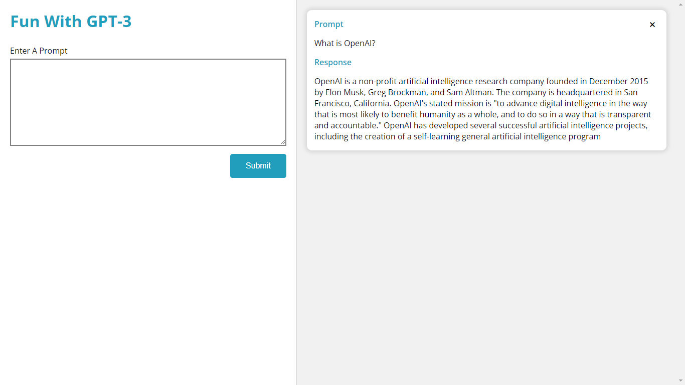

# Fun With GPT-3

This is an application that sends user prompts to OpenAI GPT-3 and display the responses in a list. The responses from OpenAI's API are saved to the browser's local storage. Each individual response can also be deleted and removed from the list.

